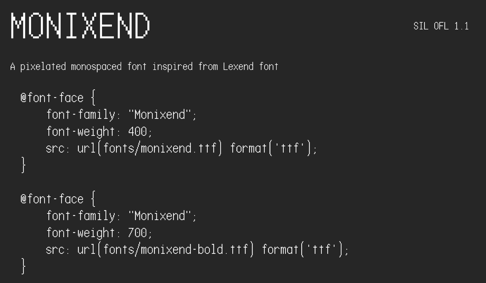

# Monixend
Meet Monixend, a pixelated monospaced font inspired from Lexend Font. This font is designed from FontStruct, featuring Latin, Greek, and Cyrillic support.

## Fun fact
The name of "Monixend" is the shortened term form of "Monospaced Imitation of Lexend", winch is chosen to make the font name look related to Lexend font.

## Disclaimer
XLS2009's Monixend font is not affiliated with Lexend font, this also applies to other font creators and fonts with similar name made by different creators.
